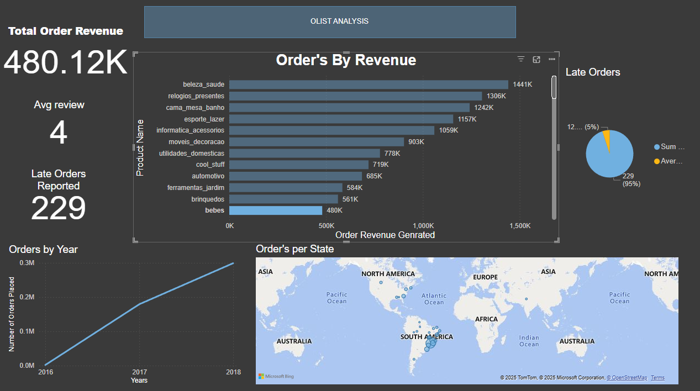

# olist-analysis

# 🛍️ Olist E-commerce Analytics Project

This project simulates the role of a Data Analyst 

## 📌 Objective

Analyze e-commerce behavior across customers, products, and orders to generate business KPIs using Python, SQL, and dashboarding tools.

# 📦 Olist E-Commerce Data Analysis & Power BI Dashboard

An end-to-end data analytics project that transforms raw Brazilian e-commerce data into business-ready insights and dashboards. Built to demonstrate strong **data cleaning, transformation, and BI reporting** skills — ideal for **Data Analyst**, **BI Analyst**, and **ETL Developer** roles.

---

## 🔧 Tech Stack

- **Python (pandas, matplotlib)** – for ETL, KPI generation, and EDA
- **Power BI** – for interactive dashboard and business reporting
- **GitHub + Colab** – for reproducible code and collaboration

---

## 🧪 Project Overview

| Phase | Tools Used | Description |
|-------|------------|-------------|
| ✅ ETL & Join | Python (Colab) | Cleaned and merged multiple CSVs into a unified dataset |
| ✅ KPI & Metrics | Python | Calculated AOV, late % deliveries, review scores, revenue, etc. |
| ✅ Visualizations | Power BI | Created a fully interactive dashboard with cards, filters, and visuals |
| ✅ Enriched Output | `olist_model_ready.csv` | Feature-rich dataset for ML, dashboards, or advanced analytics |

---

> 📍 All metrics are filterable by **state**, **month**, and **product category**

| Metric | Description |
|--------|-------------|
| 💰 **Total Revenue** | Sum of order value (product + freight) |
| 📦 **Top Product Categories** | Bar chart by category revenue |
| 🚚 **% Late Deliveries** | Share of orders delivered late |
| ⭐ **Avg. Review Score** | Avg customer satisfaction score (out of 5) |
| 🗺️ **Revenue by State** | Bar/Map visual by geography |
| 📈 **Monthly Revenue Trend** | Time series for business growth |
| 🧁 **On-Time vs Late Orders** | Pie chart breakdown |

### 📷 Sample Dashboard Preview

---

## 💡 Key Insights

- 🔝 **Top 5 categories** drive over 60% of total revenue
- 🚚 **~15% of orders** are delivered late, especially in remote states
- 🌟 **Avg. customer satisfaction** is high at 4.2 / 5
- 📈 Monthly order volume peaks during the holiday period (Q4)

---

## 📦 Final Dataset (`olist_model_ready.csv`)

This enriched dataset contains:
- `order_id`, `customer_id`, `state`, `category`
- `order_value`, `freight_value`, `num_items`
- `review_score`, `delivery_duration`, `delivery_delay`, `is_late`
- `aov_customer`, `order_month`

Ready for:
- Machine learning (regression/classification)
- Customer segmentation
- Revenue forecasting
- Streamlit apps or BI tools

📬 Contact: [sohamwaghe47@gmail.com]
